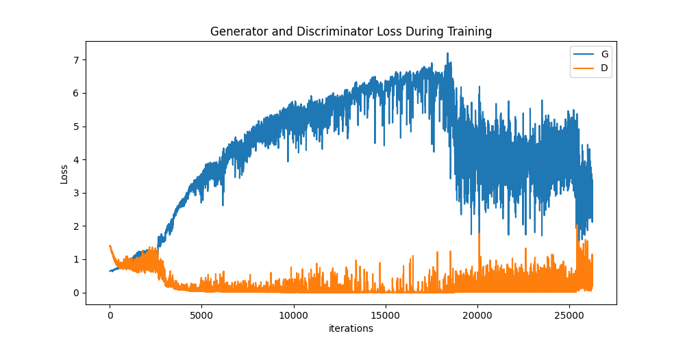

# fashionGAN
Project aimed at creating a Generative Adversial Network (GAN) for the MNIST Fanshion dataset.\
This project is inspired by the [DCGAN research paper](https://arxiv.org/pdf/1511.06434) by Radford et al.

---
## Neural network architecture
### Generative network
The generator expects an input of a b_size x 100 x 1 x 1 tensor and upscales it into a b_size x 28 x 28 x 1 output.\
This is meant to represent a 28 x 28 MNIST image. Since all MNIST images are gray scale we simply add a sigmoid function for the final activation layer to ensure all values are between 0 and 1
### Discriminatory network
The discriminator expects a tensor of size b_size x 28 x 28 x 1 like a MNIST image. After putting it through convulutional and fully connected layers it ultimately outputs a value between 0 and 1 (due to a sigmoid function) corresponding to either the real or fake label

---
## Hyperparameters and optimizers
The given script runs for 7 epochs and uses the Adam optimizer with a lr of 0.001.
## Loss Graph

